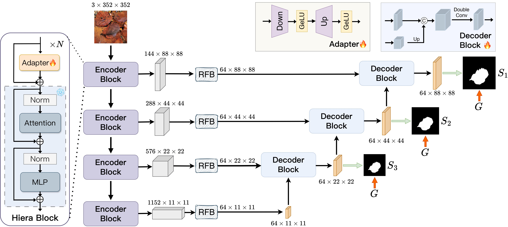

[](https://paperswithcode.com/sota/salient-object-detection-on-duts-te-1?p=sam2-unet-segment-anything-2-makes-strong)
[](https://paperswithcode.com/sota/salient-object-detection-on-dut-omron-2?p=sam2-unet-segment-anything-2-makes-strong)
[](https://paperswithcode.com/sota/salient-object-detection-on-hku-is-1?p=sam2-unet-segment-anything-2-makes-strong)
[](https://paperswithcode.com/sota/salient-object-detection-on-pascal-s-1?p=sam2-unet-segment-anything-2-makes-strong)
[](https://paperswithcode.com/sota/salient-object-detection-on-ecssd-1?p=sam2-unet-segment-anything-2-makes-strong)
[](https://paperswithcode.com/sota/image-segmentation-on-mas3k?p=sam2-unet-segment-anything-2-makes-strong)
[](https://paperswithcode.com/sota/image-segmentation-on-rmas?p=sam2-unet-segment-anything-2-makes-strong)
[](https://paperswithcode.com/sota/image-segmentation-on-msd-mirror-segmentation?p=sam2-unet-segment-anything-2-makes-strong)
[](https://paperswithcode.com/sota/image-segmentation-on-pmd?p=sam2-unet-segment-anything-2-makes-strong)

## [SAM2-UNet: Segment Anything 2 Makes Strong Encoder for Natural and Medical Image Segmentation](https://arxiv.org/abs/2408.08870)
Xinyu Xiong, Zihuang Wu, Shuangyi Tan, Wenxue Li, Feilong Tang, Ying Chen, Siying Li, Jie Ma, Guanbin Li

## Introduction
Image segmentation plays an important role in vision understanding. Recently, the emerging vision foundation models continuously achieved superior performance on various tasks. Following such success, in this paper, we prove that the Segment Anything Model 2 (SAM2) can be a strong encoder for U-shaped segmentation models. We propose a simple but effective framework, termed SAM2-UNet, for versatile image segmentation. Specifically, SAM2-UNet adopts the Hiera backbone of SAM2 as the encoder, while the decoder uses the classic U-shaped design. Additionally, adapters are inserted into the encoder to allow parameter-efficient fine-tuning. Preliminary experiments on various downstream tasks, such as camouflaged object detection, salient object detection, marine animal segmentation, mirror detection, and polyp segmentation, demonstrate that our SAM2-UNet can simply beat existing specialized state-of-the-art methods without bells and whistles.

## Clone Repository
```shell
git clone https://github.com/WZH0120/SAM2-UNet.git
cd SAM2-UNet/
```

## Prepare Datasets
You can refer to the following repositories and their papers for the detailed configurations of the corresponding datasets.
- Camouflaged Object Detection. Please refer to [FEDER](https://github.com/ChunmingHe/FEDER).
- Salient Object Detection. Please refer to [SALOD](https://github.com/moothes/SALOD).
- Marine Animal Segmentation. Please refer to [MASNet](https://github.com/zhenqifu/MASNet).
- Mirror Detection. Please refer to [HetNet](https://github.com/Catherine-R-He/HetNet).
- Polyp Segmentation. Please refer to [PraNet](https://github.com/DengPingFan/PraNet).

## Requirements
Our project does not depend on installing SAM2. If you have already configured an environment for SAM2, then directly using this environment should also be fine. You may also create a new conda environment:

```shell
conda create -n sam2-unet python=3.10
conda activate sam2-unet
pip install -r requirements.txt
```

## Training
If you want to train your own model, please download the pre-trained segment anything 2 from the [official repository](https://github.com/facebookresearch/segment-anything-2). You can also directly download `sam2_hiera_large.pt` from [here](https://dl.fbaipublicfiles.com/segment_anything_2/072824/sam2_hiera_large.pt). After the above preparations, you can run `train.sh` to start your training.

## Testing
Our pre-trained models and prediction maps can be found on [Google Drive](https://drive.google.com/drive/folders/1w2fK8kLhtEmMWZ6G6w9_J17xwgfm3lev?usp=drive_link). Also, you can run `test.sh` to obtain your own predictions.

## Evaluation
After obtaining the prediction maps, you can run `eval.sh` to get most of the quantitative results. For the evaluation of mirror detection, please refer to `eval.py` in [HetNet](https://github.com/Catherine-R-He/HetNet) to obtain the results.

## Papers based on SAM2-UNet
If you are interested in improving SAM2-UNet, the following papers may be helpful:

[2025.01] [Progressive Self-Prompting Segment Anything Model for Salient Object Detection in Optical Remote Sensing Images](https://doi.org/10.3390/rs17020342)

[2024.12] [Adapting SAM2 Model from Natural Images for Tooth Segmentation in Dental Panoramic X-Ray Images](https://doi.org/10.3390/e26121059)

## Citation and Star
Please cite the following paper and star this project if you use this repository in your research. Thank you!
```
@article{xiong2024sam2,
  title={SAM2-UNet: Segment Anything 2 Makes Strong Encoder for Natural and Medical Image Segmentation},
  author={Xiong, Xinyu and Wu, Zihuang and Tan, Shuangyi and Li, Wenxue and Tang, Feilong and Chen, Ying and Li, Siying and Ma, Jie and Li, Guanbin},
  journal={arXiv preprint arXiv:2408.08870},
  year={2024}
}
```

## Acknowledgement
[segment anything 2](https://github.com/facebookresearch/segment-anything-2)
